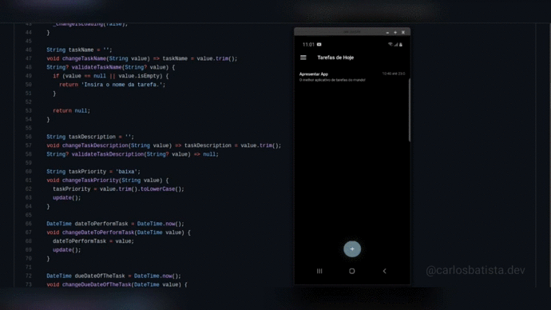

# Mini Tarefas

Projeto desenvolvido para aprendizado

O **mini tarefas**(_v1.0.0_) é um aplicativo bem simples, que visa salvar tarefas (como o próprio nome sugere), conta com uma interface simples e direta, ele faz o que diz que faz!

## Funcionalidades

    1. Salvar Tarefas;
        - Nome, Descrição, Prioridade, Data para Começar e Data para Terminar.
    2. Editar Tarefas;
    3. Apagar Tarefas;

## Detalhes sobre o Aplicativo

Obs: O aplicativo enviará notificações dependendo de qual prioridade o usúario especificar na tarefa, a única exceção para notificações está em prioridade **baixa**.

## Tecnologias Utilizadas

- Versões
    1. Flutter: 2.0.1 • channel stable
    2. Dart: 2.12.0 stable
    3. get: ^3.26.0
    4. get_storage: ^1.4.0
    5. cupertino_icons: ^1.0.2
    6. flutter_slidable: ^0.5.7
    7. flutter_datetime_picker: ^1.5.0
    8. flutter_local_notifications: ^4.0.1+2

## Considerações Finais

Estou buscando minha evolução como profissional colocando meus conhecimentos em práticas, tentando lidar com as mudanças e procurando reconhecimento;

Meu Instagram: [carlosbatista.dev](https://www.instagram.com/carlosbatista.dev)